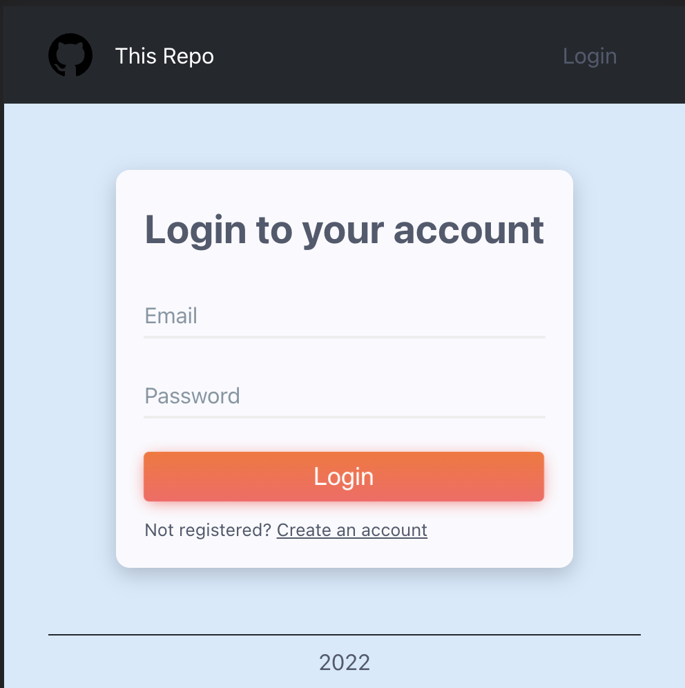
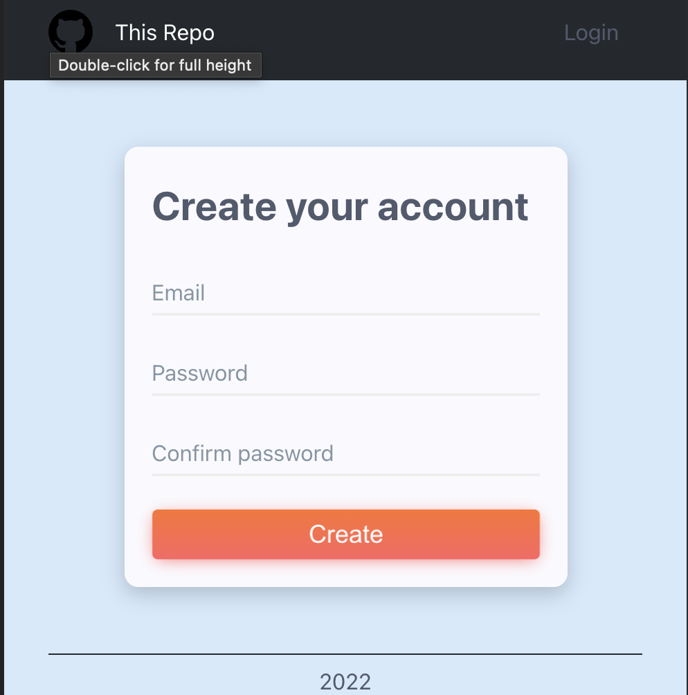
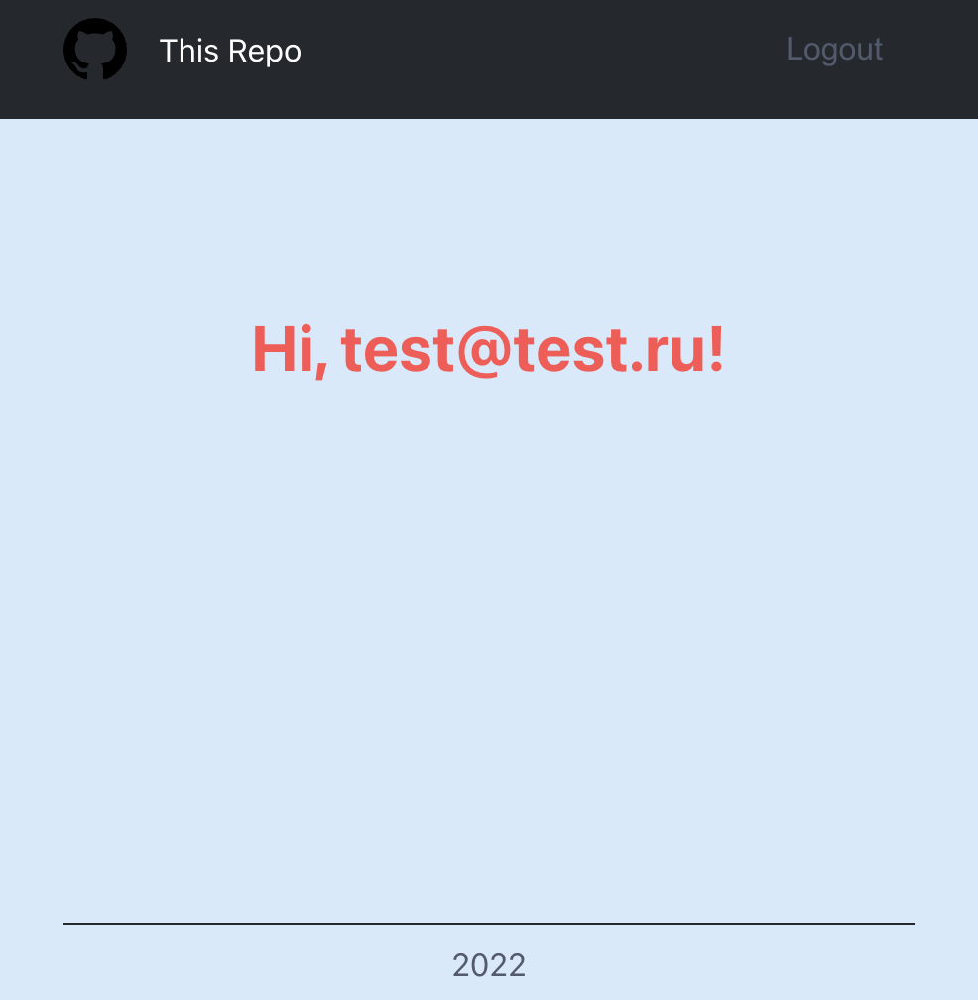

# Simple form with firebase auth

---

## Описание

- Небольшой pet-проект с формой авторизации
- Авторизация через firebase API
- Для авторизации можно использовать тестовый аккаунт:
  - login: test@test.com
  - pass: 123456

## Зависимости

- react 17.0.2+
- react-firebase-hooks 4.0.1+
- react-router-dom 6.2.1+
- sass 1.45.2+
- typescript 4.5.4+

## Разработчикам

- Установка `npm i`
- Запуск сервера `npm start`
- Сборка проекта `npm run build`

## Как скачать

- По HTTPS: `git clone https://github.com/PsarewIvan/evil-martians-form.git`
- По SSH: `git clone git@github.com:PsarewIvan/evil-martians-form.git`
